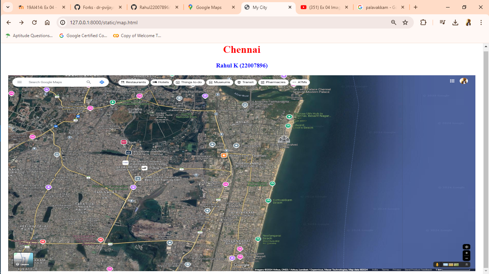
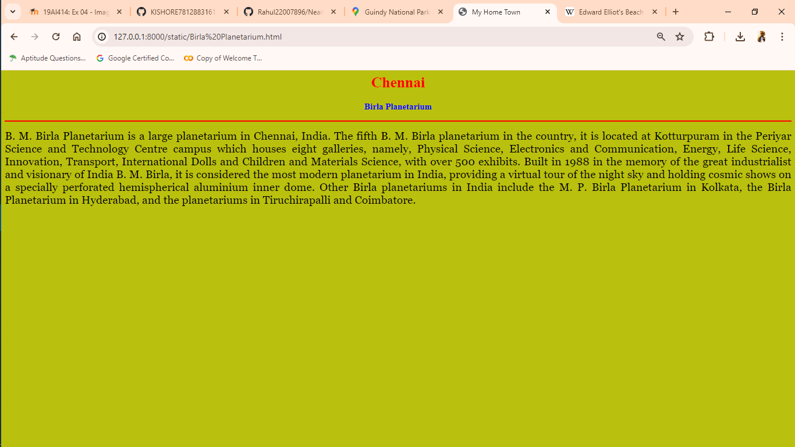
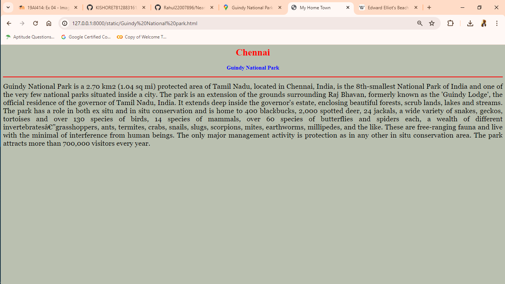
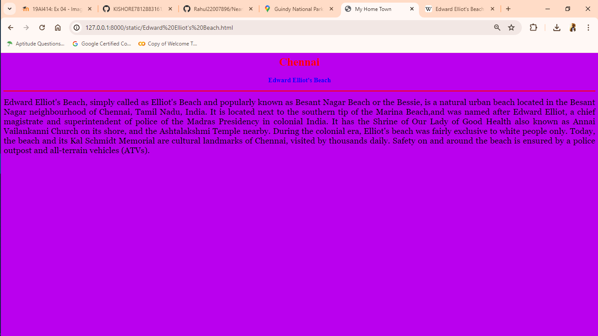
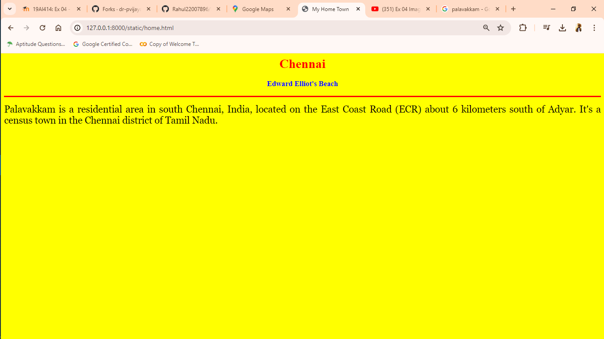

# Ex04 Places Around Me
## Date: 

## AIM
To develop a website to display details about the places around my house.

## DESIGN STEPS

### STEP 1
Create a Django admin interface.

### STEP 2
Download your city map from Google.

### STEP 3
Using ```<map>``` tag name the map.

### STEP 4
Create clickable regions in the image using ```<area>``` tag.

### STEP 5
Write HTML programs for all the regions identified.

### STEP 6
Execute the programs and publish them.

## CODE
```c
MAP.html

<html>
    <head>
        <title>My City</title>
    </head>
    <body>
        <h1 align="center">
            <font color="red"><b>Chennai</b></font>
        </h1>
        <h3 align="center">
            <font color="blue"><b>Rahul K (22007896)</b></font>     
        </h3> 
        <center>
            
            <map name="MyCity">
                <area shape="react" coords="773,492,902,427" href="home.html" title="My Home Town">
                <area shape="react" coords="216,412,645,321" href="Guindy National park.html" title="Gunidy National Park">
                <area shape="react" coords="448,598,171,233" href="IITM.html" title="IITM">
                <area shape="react" coords="643,225,819,162" href="Edward Elliot's Beach.html" title="Edward Elliot's Beach">
                <area shape="react" coords="216,312,445,121" href="Birla Planetarium.html" title="Birla Planetarium">
            </map>
        </center>
    </body>
</html>    

Birla Planetarium.html
<html>
    <head>
        <title>My Home Town</title>
    </head>
    <body bgcolor="babycornred">
        <h1 align="center">
            <font color="red"><b>Chennai</b></font>
        </h1>
        <h3 align="center">
            <font color="blue"><b>Birla Planetarium</b></font>
        </h3>
        <hr size="3" color="red">
        <p align="justify">
            <font face="Georgia" size="5">
                B. M. Birla Planetarium is a large planetarium in Chennai, India.
                The fifth B. M. Birla planetarium in the country, it is located at Kotturpuram in the Periyar Science and Technology Centre campus which houses eight galleries, namely, Physical Science, Electronics and Communication, Energy, Life Science, Innovation, Transport, International Dolls and Children and Materials Science, with over 500 exhibits.
                Built in 1988 in the memory of the great industrialist and visionary of India B. M. Birla, it is considered the most modern planetarium in India, providing a virtual tour of the night sky and holding cosmic shows on a specially perforated hemispherical aluminium inner dome.
                Other Birla planetariums in India include the M. P. Birla Planetarium in Kolkata, the Birla Planetarium in Hyderabad, and the planetariums in Tiruchirapalli and Coimbatore.
        </font>
        </p>    
    </body>
</html>

Guindy National Park.html

<html>
    <head>
        <title>My Home Town</title>
    </head>
    <body bgcolor="babycornblue">
        <h1 align="center">
            <font color="red"><b>Chennai</b></font>
        </h1>
        <h3 align="center">
            <font color="blue"><b>Guindy National Park</b></font>
        </h3>
        <hr size="3" color="red">
        <p align="justify">
            <font face="Georgia" size="5">
            Guindy National Park is a 2.70 km2 (1.04 sq mi) protected area of Tamil Nadu, located in Chennai, India, is the 8th smallest National Park of India and one of the very few national parks situated inside a city.
            The park is an extension of the grounds surrounding Raj Bhavan, formerly known as the 'Guindy Lodge', the official residence of the governor of Tamil Nadu, India.It extends deep inside the governor's estate, enclosing beautiful forests, scrub lands, lakes and streams. The park has a role in both ex situ and in situ conservation and is home to 400 blackbucks, 2,000 spotted deer, 24 jackals, a wide variety of snakes, geckos, tortoises and over 130 species of birds, 14 species of mammals, over 60 species of butterflies and spiders each, a wealth of different invertebrates—grasshoppers, ants, termites, crabs, snails, slugs, scorpions, mites, earthworms, millipedes, and the like.
            These are free-ranging fauna and live with the minimal of interference from human beings. The only major management activity is protection as in any other in situ conservation area. The park attracts more than 700,000 visitors every year.
        </font>
        </p>    
    </body>
</html>

IITM.html
<html>
    <head>
        <title>My Home Town</title>
    </head>
    <body bgcolor="babycornpurple">
        <h1 align="center">
            <font color="white"><b>Chennai</b></font>
        </h1>
        <h3 align="center">
            <font color="white"><b>IITM</b></font>
        </h3>
        <hr size="3" color="black">
        <p align="justify">
            <font face="Georgia" size="5" font color="white">
                Indian Institute of Technology Madras (popularly known as IITM or IIT Madras) is a public technical university located in Chennai, Tamil Nadu, India.
                It is one of the eight public Institutes of Eminence of India. As one of the Indian Institutes of Technology (IITs), IIT Madras is also recognized as an Institute of National Importance.
                Founded in 1959 with technical and financial assistance from the former government of West Germany, it was the third Indian Institute of Technology established by the Government of India.
                IIT Madras is consistently ranked as the #1 ranked university in both overall as well as engineering institute in India by the Ministry of Education's National Institutional Ranking Framework since the inception of the NIRF ranking system in 2016.
            </font>
        </p>    
    </body>
</html>

Edwards Elliot's Beach.html
<html>
    <head>
        <title>My Home Town</title>
    </head>
    <body bgcolor="babycornpurple">
        <h1 align="center">
            <font color="white"><b>Chennai</b></font>
        </h1>
        <h3 align="center">
            <font color="white"><b>IITM</b></font>
        </h3>
        <hr size="3" color="black">
        <p align="justify">
            <font face="Georgia" size="5" font color="white">
                Indian Institute of Technology Madras (popularly known as IITM or IIT Madras) is a public technical university located in Chennai, Tamil Nadu, India.
                It is one of the eight public Institutes of Eminence of India. As one of the Indian Institutes of Technology (IITs), IIT Madras is also recognized as an Institute of National Importance.
                Founded in 1959 with technical and financial assistance from the former government of West Germany, it was the third Indian Institute of Technology established by the Government of India.
                IIT Madras is consistently ranked as the #1 ranked university in both overall as well as engineering institute in India by the Ministry of Education's National Institutional Ranking Framework since the inception of the NIRF ranking system in 2016.
            </font>
        </p>    
    </body>
</html>

My Home Town.html
<html>
    <head>
        <title>My Home Town</title>
    </head>
    <body bgcolor="yellow">
        <h1 align="center">
            <font color="red"><b>Chennai</b></font>
        </h1>
        <h3 align="center">
            <font color="blue"><b>Edward Elliot's Beach</b></font>
        </h3>
        <hr size="3" color="red">
        <p align="justify">
            <font face="Georgia" size="5">
                Palavakkam is a residential area in south Chennai, India, located on the East Coast Road (ECR) about 6 kilometers south of Adyar. It's a census town in the Chennai district of Tamil Nadu.
        </font>
        </p>    
    </body>
</html>

``` 

## OUTPUT




 
 
## RESULT
The program for implementing image maps using HTML is executed successfully.
